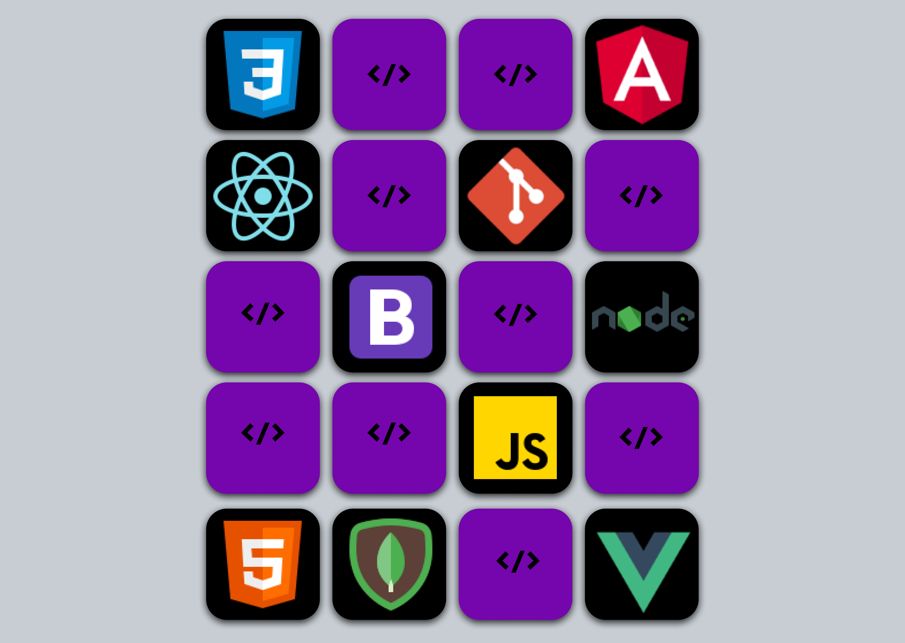

<h1 align="center"> Jogo da Memória </h1>

Projeto proposto no curso de Desenvolvimento Web Full Stack (Programdor Br).

<a href="https://raynnenogueira.github.io/jogodamemoria/" target="_blank">Visite aqui o projeto</a>

 

<h3 id="tecnologias"> Tecnologias Utilizadas</h3>

  
  
  

 

  

